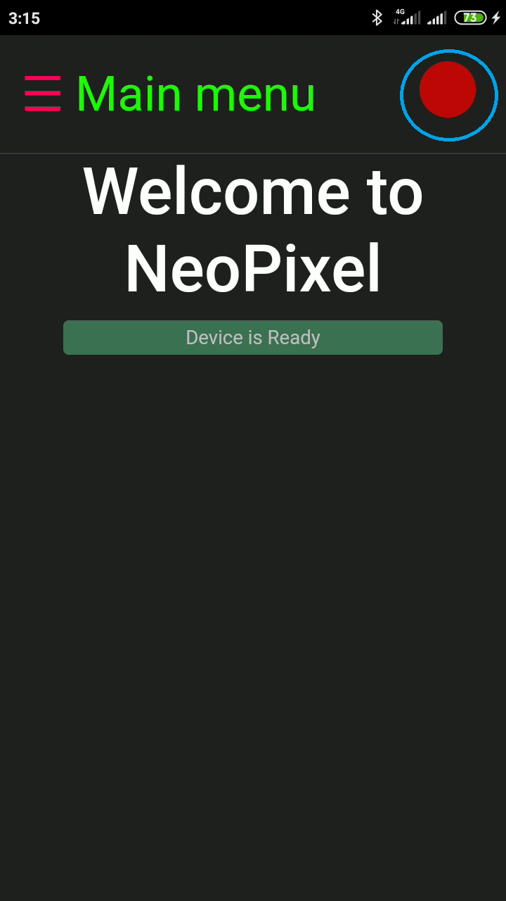

# neoPixelBT
Mobile app created in cordova to control NeoPixel leds through Bluetooth.

``` I started this project to fulfill a life long dream... ```

``` Creating light for those in the dark ```

This App runs hand-in-hand with my [ESP32NeoPixelControl](https://github.com/sirpauley/ESP32NeoPixelControl)

## Using this APP on android
* Build APK with cordova, on request I can send you a unsigned APK [email me](mailto:sirpauley@gmail.com)
* Install it on your android device
* This project was develop with Andorid and IOS in mind Please note I have not tested or build this app for IOS yet(lack of access to a MAC)

# Screenshots of the app

| Landing Page | Main | Connection status | Menu |
|:-----------:|:-------:|:---------------:|:-----:|
|  |  |  |  |

| Connection screen | Searching permission | Searching | Device found | connection is successfull | Connected status |
|:-----------------:|:--------------------:|:---------:|:------------:|:------------------------:|:----------------:|
|  |  |  |  |  |  |

| ColorWheel | Modes selection screen | Selecting a diffrent mode |
|:----------:|:----------------------:|:-------------------------:|
  |  |  |

## few intresting facts (Things I learned)
* for 1 I created a dynamic menu. Built according to a JSON object
* I discovered it is possible to use Bootstrap inside Cordova framework, It helps with screen designs
* When you reopen the App it tries to connect to device previous know device

# Features
* Connect to Low Energy Bluetooth like ESP32
* ColorWheel for selecting colors
* The app store last known setting in localStorage like the last device connected, colors and modes selected
* ColorModes for neopixel added, also checkout [ESP32NeoPixelControl](https://github.com/sirpauley/ESP32NeoPixelControl) for examples
* Display connection status on the menu bar
* Cordova plugins used:
    * cordova-plugin-bluetooth-serial 0.4.7 "Bluetooth Serial"
    * cordova-plugin-dialogs 2.0.2 "Notification"
    * cordova-plugin-listpicker 2.2.2 "ListPicker"
    * cordova-plugin-whitelist 1.3.4 "Whitelist"
* What this app does it gives you a friendly interface to chose color and mode and compile it into a JSON object to send to the ESP32
Example: 

```
{
    "red":255,
    "green":255,
    "blue":255,
    "mode":"solid",
}
```
See [ESP32NeoPixelControl](https://github.com/sirpauley/ESP32NeoPixelControl) for explenation on the modes

## Giving credit
* [Bootstrap](https://getbootstrap.com/docs/4.0/getting-started/introduction/)
* [cordova-plugin-listpicker](https://github.com/roberthovhannisyan/PhoneGap-Plugin-ListPicker)
* [Tutorial Point](https://www.tutorialspoint.com/cordova/index.htm) for an easy explination of how Cordova works
* [Bluetooth Library](https://github.com/don/BluetoothSerial) for cordova  Done by [Don](https://github.com/don), Thank you 

## TO-DO
* Build for IOS
* Test on IOS
* While searching for devices, make the Loader circle display in Modal